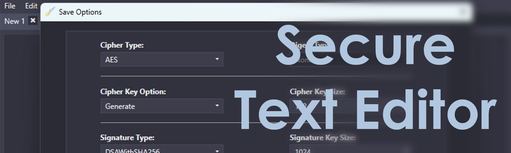

# SecureTextEditor

    

## Overview

A simple text editor capable of securly storing created texts using a variety of methods based on the *Bouncy Cast* APIs.

## Dependencies

- [*Bouncy Castle*](https://www.bouncycastle.org/csharp/index.html)
- [*Newtonsoft.Json*](https://github.com/JamesNK/Newtonsoft.Json)
- [*Adonis UI*](https://github.com/benruehl/adonis-ui)
